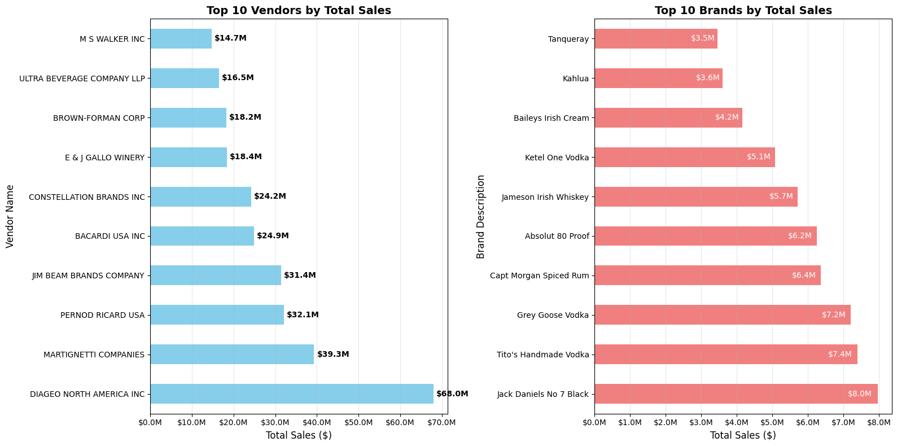

# Vendor Performance Analysis — Notebook Summary

## Objective
Provide an executive view of vendor performance by integrating sales, purchases, inventory, and cost data to identify margin drivers, outliers, and improvement opportunities.

## Data & Methods
- **Data sources**: transactional sales and purchases, inventory records, and cost components (purchase price, freight).
- **Core metrics**: revenue, total cost, gross profit (and margin), stock turnover, vendor/brand contribution.
- **Approach**:
  1. Load and consolidate datasets.
  2. Compute KPIs per vendor, brand, and item.
  3. Exploratory Data Analysis (summary stats, distributions, correlation).
  4. Visual analytics for outliers, ranking, and contribution.

## Key Insights
- Vendors and product families with **negative gross margins** detected.
- **Outliers** identified in purchase price and freight impacting profitability.
- **Ranking of vendors/brands** by revenue and gross profit to surface top/bottom performers.
- **Sales vs. purchases divergences** suggest reliance on older inventory or stockout risk.
- **Slow-moving inventory** highlighted for obsolescence risk; fast-moving for replenishment alignment.

## Visualizations
Exported figures (if present in the workspace):
- `DistributionPolts.png`
- `Boxplots.png`
- `correlationHeadmap.png`
- `TopVendors.png`
- `pareto.png`


> You can embed any of the above in reports:
> ```markdown
> 
> ```

## KPIs Calculated
- **Gross Profit** and **Gross Margin** by vendor and brand  
- **Revenue**, **Total Cost** (incl. freight)  
- **Stock Turnover** and velocity flags (slow/fast movers)  
- **Contribution** analysis (Pareto) for vendors and brands  

## Recommended Actions
- **Selective renegotiation** with high-volume, low-margin vendors.
- **Catalog optimization**: reduce or replace products with chronic negative margins and low turnover.
- **Freight optimization**: review contracts, consolidate shipments to reduce variance and cost.
- **Inventory planning**: align purchasing to sales velocity; monitor stockout risk.
- **Ongoing monitoring**: monthly dashboard with thresholds for price/margin outliers.

## Reproducibility Notes
- The notebook runs an EDA workflow (summary statistics, distributions, correlation, vendor ranking, Pareto contribution).
- Figures are saved to disk and can be directly embedded in LaTeX or slides.
